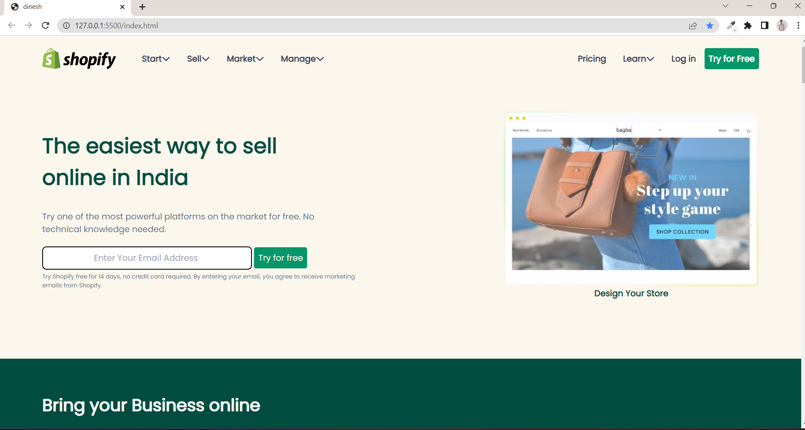
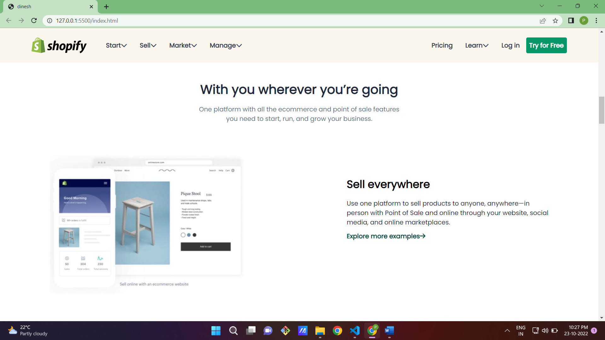
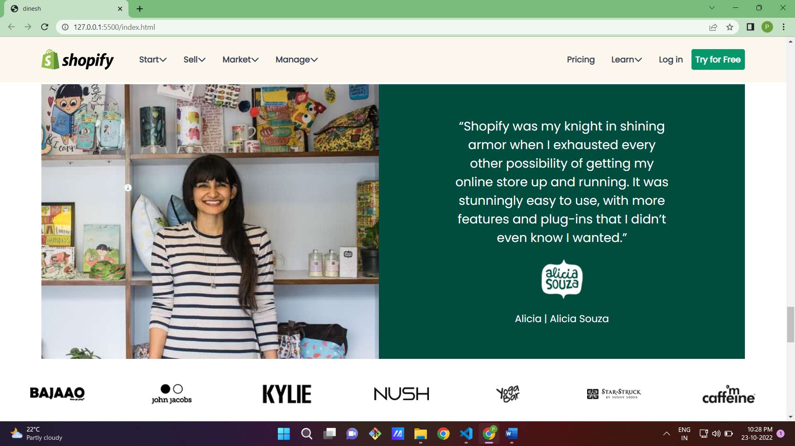
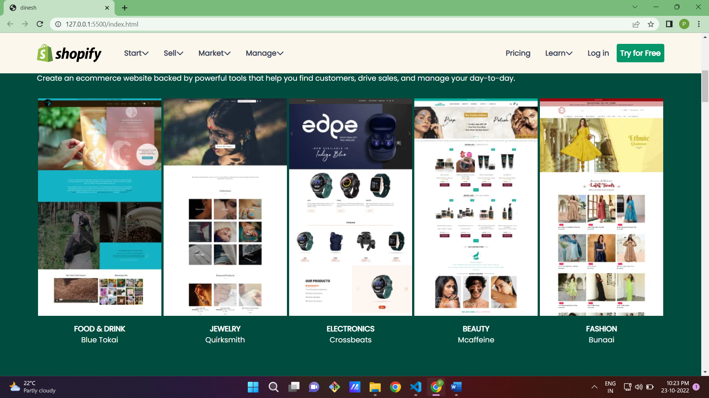
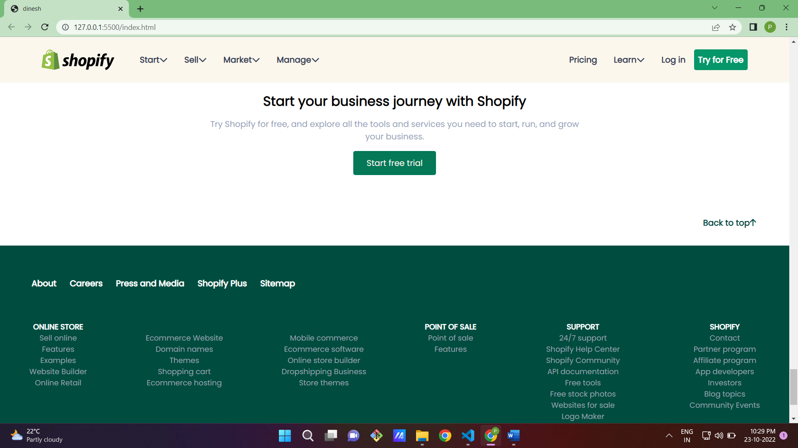
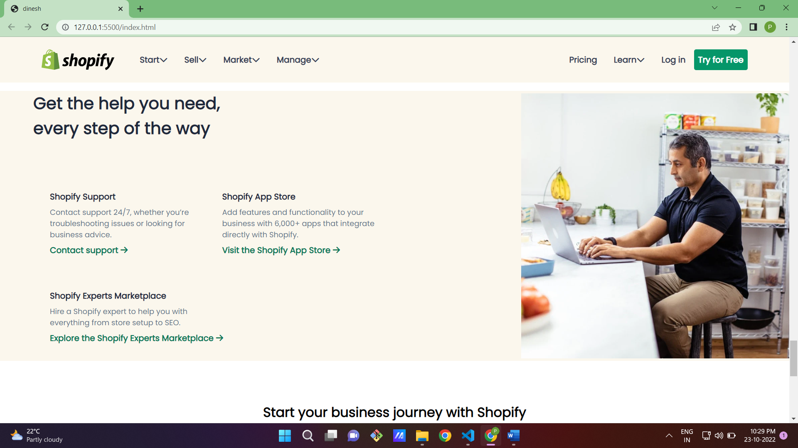
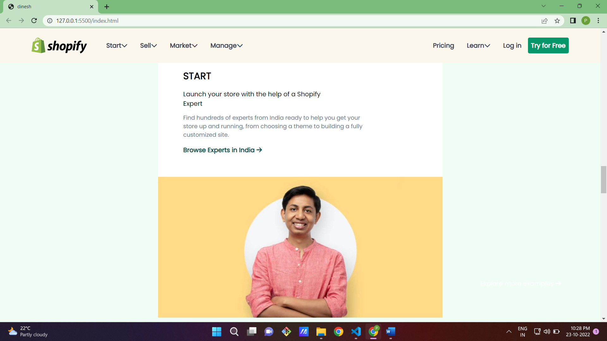
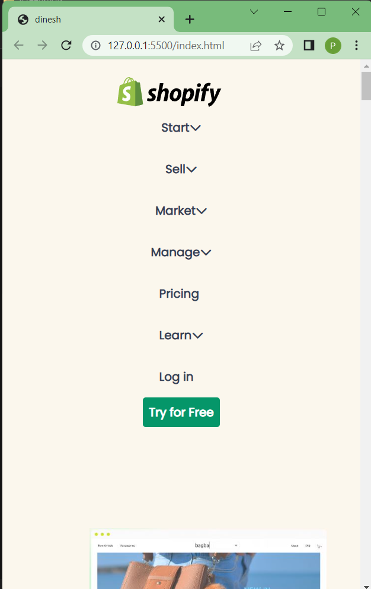

# project Shopify Clone

By Dinesh Bana

- this Shopify clone is mobile responsive and Desktop with amazing user experience

- In this project i have gained experties in HTML & CSS and Tailwind CSS.
  -learned about responsive design and

- Learned About Positions,Flexbox and other styling components.

- It Took me around 7 hours to complete this project.

## Project Link: [Shopify Clone](https://shopifycloneproject.netlify.app/)
